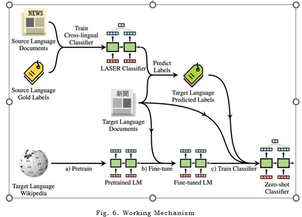

# Cross-Lingual Text Extraction Using Neural Networks

## Overview

This project focuses on extracting multilingual text using deep learning and NLP techniques.

It uses cross-lingual embeddings to map multiple languages into a shared semantic space.

---

## Features

- Multilingual text processing
- Cross-lingual embeddings (XLM-R, mBERT)
- Named Entity Recognition (NER)
- Language detection and translation

---

## Technologies

- Python
- Transformers (HuggingFace)
- NLP
- Deep Learning

---

## Methodology

- Preprocessing text
- Generating embeddings using XLM-R
- Named Entity Recognition
- Information extraction

---

## Results

---

## Applications

- E-commerce
- Document processing
- Multilingual search systems

---

## Author

Kasa Delhi Babu
